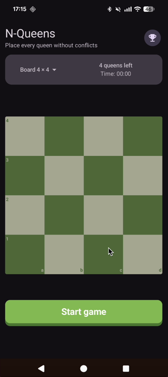
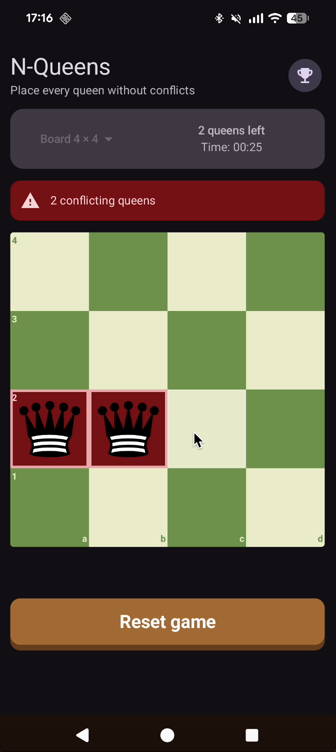
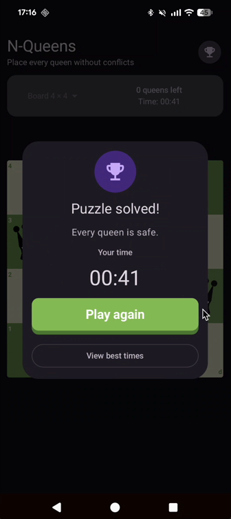

# N-Queens Android

[](https://github.com/rafalniski/n-queens-android/actions/workflows/android-ci.yml)

An Android puzzle game based on the N-Queens problem, built with Kotlin and Jetpack Compose. The goal is to place `n` queens on an `n × n` chessboard without any two queens sharing a row, column, or diagonal.

## Screenshots

<p align="center">
  
  
  
</p>

## Demo

[Watch the gameplay video](docs/video/nqueens-android-video.mp4)

## Features

- Board sizes from `4 × 4` to `12 × 12`
- Real-time conflict validation and highlighting
- Queen counter, game timer, and reset action
- Placement, conflict, and victory animations
- Ten best times stored separately for every board size

## Build and run

The project requires JDK 17, Android SDK 37, and a recent Android Studio version.

```bash
git clone https://github.com/rafalniski/n-queens-android.git
cd n-queens-android
./gradlew assembleDebug
```

On Windows, use `gradlew.bat assembleDebug`. To run the app, open the project in Android Studio and select the `app` configuration, or connect a device and run:

```bash
./gradlew installDebug
```

## Testing

```bash
./gradlew testDebugUnitTest
./gradlew lintDebug
./gradlew connectedDebugAndroidTest
```

The unit tests cover the game rules, state transitions, timer, ranking, and persistence. Compose UI tests cover the main player interactions and screen states. GitHub Actions runs unit tests, Android Lint, and a debug build on every push to `main` and every pull request.

## Architecture decisions

The app uses a lean Clean Architecture approach with MVVM and unidirectional data flow. UI events are represented as `GameAction` values, handled by `GameViewModel`, and produce an immutable `GameUiState` exposed through `StateFlow`.

The code is organised by feature and then by responsibility:

- `domain` contains the game models, N-Queens rules, and repository contract.
- `data` contains the DataStore implementation used for best times.
- `presentation` contains the ViewModel, UI state, timer, and Compose UI.
- `app` is the composition root and connects the dependencies.

The project intentionally uses one Gradle module. For an application of this size, additional modules would add configuration and navigation overhead without meaningful isolation. Package boundaries keep the responsibilities separated and can be converted into modules if the app grows.

Dependencies are created manually in `AppContainer`. A DI framework would be unnecessary for the current dependency graph. Best times are persisted with Preferences DataStore and exposed through the domain-level `BestTimesRepository` contract.

## AI usage

AI was used during planning, architecture decisions, implementation support, writing tests, and preparing this README 🙂
